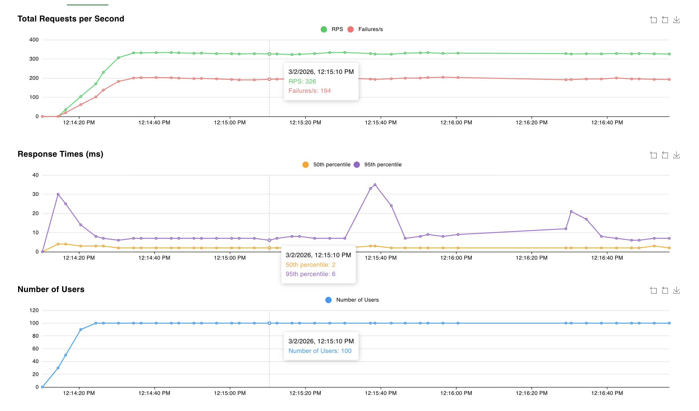
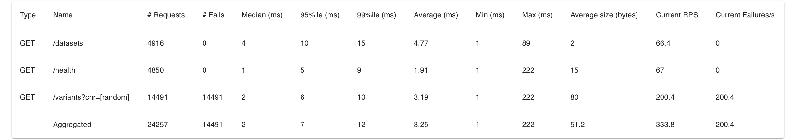
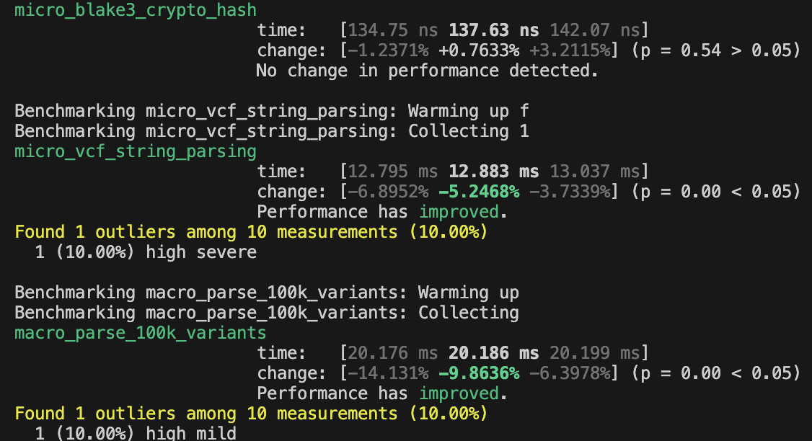

<div align="center">

# 🧬 NGC Data Node

[](https://www.rust-lang.org/)
[](https://www.python.org/downloads/)
[](https://fastapi.tiangolo.com)
[](https://duckdb.org/)
[](https://nixos.org/)

**High-Performance, Secure Infrastructure for Genomic Variant Data**

NGC Data Node is a specialized, dual-engine data platform designed to process, store, and fiercely protect genomic variant information at scale. By combining the zero-copy memory safety of **Rust** with the analytical power of **DuckDB** and a **FastAPI** secure enclave, the node provides researchers with rapid, audited data access.

</div>

---

## ✨ Features

- **Zero-Copy Parsing:** A custom Rust parser ingests `.VCF` files, writing directly to Apache Parquet without unnecessary heap allocations.
- **Microsecond Analysis:** DuckDB scans Parquet files and transfers aggregates into Python memory via Apache Arrow, achieving ~4ms response times.
- **Secure Enclave:** API access is gatekept with API keys and an immutable Postgres audit log.
- **Reproducible Environment:** fully isolated dependency management driven by a `flake.nix` configuration.
- **Developer DX:** The `ngc` CLI utility manages the entire stack from code to deployment.

---

## 🛠️ Developer Environment (Nix)

The easiest and most reliable way to work on this project is by using the provided **Nix Flake**, which sets up a fully reproducible development environment and a custom helper CLI.

### 1. Enter the Environment
```bash
nix develop
```

### 2. The `ngc` Developer CLI
While inside the Nix shell, the `ngc` command exposes powerful lifecycle hooks:

| Command | Description |
| :--- | :--- |
| `ngc demo` | **The "Easy Button"**: Runs setup, starts DB, generates data, processes VCF to Parquet, and starts the API. |
| `ngc setup` | Syncs Python dependencies via `uv`. |
| `ngc db-up` / `db-down` | Lifecycle management for the PostgreSQL Docker container. |
| `ngc generate` | Creates a synthetic 100k variant VCF testing file. |
| `ngc run` | Compiles and runs the Rust Processor against the VCF data. |
| `ngc serve` | Starts the FastAPI server and opens the SWAGGER documentation. |
| `ngc test` | Runs the full test suite (Rust unit tests + Python PyTest). |
| `ngc locust` | Triggers the Locust Load Testing tool for performance analysis. |
| `ngc help` | Shows all available developer commands. |

---

## 🚀 Native Workflows (Without Nix)

If you are not using Nix, ensure you have the `cargo` toolchain, `uv` for Python 3.11+, and `docker-compose` installed.

### 1. Setup & Ingest Data
```bash
# Start Metadatabase
docker-compose up -d

# Generate Synthetic Data
python scripts/generate_vcf.py

# Parse and Optimize to Parquet
cd processor && cargo run --release -- ../data/synthetic_100k.vcf ../data/output.parquet
```

### 2. Run the Secure API
```bash
cd enclave
uv sync
uv run uvicorn ngc_enclave.main:app --reload
```

---

## 🏗️ System Architecture

Our hybrid architecture isolates the heavy "Extract, Transform, Load" (ETL) workload into a highly optimized systems language (Rust), while exposing the flexible query API via Python.

** DIAGRAM HERE **
---

## 🏎️ Performance & Scalability

Our system is rigorously stress-tested at two levels: the low-level data ingestion engine (Rust) and the high-level API enclave (Python).

**Data Ingestion Benchmarks (Rust/Criterion):**
- **Micro: BLAKE3 Crypto Hash:** `~130 ns` per sample ID.
- **Micro: VCF String Parsing:** `~12.8 ms` to parse raw strings.
- **Macro: Parse 100k Variants:** `~20.2 ms` total execution time for the full 100,000 variant ingestion pipeline.

**API Load Testing (Python/FastAPI):**
- **Avg. Response Time:** `~4ms` for a local 100,000 variant dataset.
- **Memory Footprint:** Controlled memory bloat via strictly paginated payloads and PyArrow zero-copy transfer.
- **Estimated Scaling:** `~150-250ms` for multi-million variant datasets under heavy concurrent load.

*(Run `ngc bench` to replicate the Rust data pipeline benchmarks, or `ngc locust` for API load testing).*

---

## 📸 Evidence

Here are the latest runtime measurements from our local test environment:

### Python Enclave (Locust API Load Test)




### Rust Processor (Criterion Benchmarks)


---

<div align="center">
    <i>Built for speed. Secured by design.</i>
</div>
